# KidneyStone Manager

KidneyStone Manager este o aplicație web pentru gestionarea analizelor medicale, cu accent pe organizarea rezultatelor, atașarea fișierelor medicale și generarea unei interpretări informative folosind inteligență artificială.

Aplicația este formată dintr-un frontend React și un backend Spring Boot, iar comunicarea dintre cele două părți se realizează printr-un API REST. Datele sunt stocate într-o bază de date PostgreSQL, iar aplicația utilizează servicii cloud externe pentru interpretare AI și trimitere email.

---

## 1. Introducere

Scopul proiectului este dezvoltarea unei aplicații web care permite utilizatorilor să își gestioneze analizele medicale într-un mod simplu, organizat și accesibil.

Aplicația oferă următoarele funcționalități:

- înregistrare utilizator;
- autentificare utilizator;
- salvare token JWT în browser;
- adăugare analiză medicală;
- listare analize;
- căutare și filtrare analize;
- editare analiză;
- ștergere analiză;
- generare interpretare AI;
- upload fișier pentru analiză;
- download fișier atașat;
- logout;
- trimitere email de confirmare după înregistrarea utilizatorului prin SendGrid;

Tehnologii utilizate:

- React pentru frontend;
- Spring Boot pentru backend;
- PostgreSQL pentru baza de date;
- Railway pentru baza de date cloud;
- OpenAI API pentru interpretarea analizelor;
- SendGrid API pentru trimiterea emailurilor;
- GitHub pentru versionarea codului sursă.

Servicii cloud utilizate prin API:

1. OpenAI API — pentru generarea interpretărilor AI.
2. SendGrid API — pentru trimiterea emailurilor.

---

## 2. Descriere problemă

Gestionarea analizelor medicale poate deveni dificilă atunci când rezultatele sunt păstrate în documente separate, emailuri, fișiere locale sau aplicații diferite. Utilizatorul poate pierde rapid evidența analizelor, a valorilor și a fișierelor asociate.

KidneyStone Manager rezolvă această problemă prin centralizarea analizelor într-o aplicație web. Utilizatorul poate salva informații relevante despre fiecare analiză:

- tipul analizei;
- valoarea rezultatului;
- unitatea de măsură;
- data recoltării;
- fișierul medical atașat;
- interpretarea AI generată.

Aplicația oferă și o bară de căutare pentru filtrarea rapidă a analizelor după tip, valoare, unitate, dată sau nume fișier.

Interpretarea AI are rol informativ și nu înlocuiește consultul medical.

---

## 3. Descriere API

Backend-ul este implementat în Spring Boot și expune un API REST. Endpointurile sunt grupate în controllere.

---

### 3.1 AuthController

Controller responsabil pentru înregistrare și autentificare.

Cale de bază:

```http
/api/auth
```

---

#### Register

```http
POST /api/auth/register
```

Controller:

```text
AuthController
```

Descriere:

Înregistrează un utilizator nou.

Request body:

```json
{
  "username": "geo_test",
  "email": "geo@test.com",
  "password": "parola123"
}
```

Response example:

```json
{
  "token": "jwt_token",
  "username": "geo_test",
  "email": "geo@test.com"
}
```

---

#### Login

```http
POST /api/auth/login
```

Controller:

```text
AuthController
```

Descriere:

Autentifică utilizatorul și returnează un token JWT.

Request body:

```json
{
  "email": "geo@test.com",
  "password": "parola123"
}
```

Response example:

```json
{
  "token": "jwt_token",
  "username": "geo_test",
  "email": "geo@test.com"
}
```

---

### 3.2 AnalysisController

Controller responsabil pentru operațiile CRUD asupra analizelor, upload și download fișiere.

Cale de bază:

```http
/api/analyses
```

Endpointurile din acest controller necesită autentificare prin JWT.

Header folosit:

```http
Authorization: Bearer <jwt_token>
```

---

#### Create analysis

```http
POST /api/analyses
```

Controller:

```text
AnalysisController
```

Metodă controller:

```text
createAnalysis
```

Descriere:

Adaugă o analiză medicală pentru utilizatorul autentificat.

Request body:

```json
{
  "analysisType": "Glucoza",
  "value": 105,
  "unit": "mg/dL",
  "collectionDate": "2026-05-06"
}
```

Response example:

```json
{
  "id": 3,
  "analysisType": "Glucoza",
  "value": 105.0,
  "unit": "mg/dL",
  "collectionDate": "2026-05-06",
  "createdAt": "2026-05-06T22:12:51",
  "userId": 1,
  "aiInterpretation": null,
  "fileName": null,
  "filePath": null,
  "fileType": null
}
```

---

#### Get all analyses

```http
GET /api/analyses
```

Controller:

```text
AnalysisController
```

Metodă controller:

```text
getAnalyses
```

Descriere:

Returnează toate analizele utilizatorului autentificat.

Response example:

```json
[
  {
    "id": 3,
    "analysisType": "Glucoza",
    "value": 105.0,
    "unit": "mg/dL",
    "collectionDate": "2026-05-06",
    "createdAt": "2026-05-06T22:12:51",
    "userId": 1,
    "aiInterpretation": "Interpretare informativă generată de AI.",
    "fileName": "analiza.pdf",
    "filePath": "uploads/uuid_analiza.pdf",
    "fileType": "application/pdf"
  }
]
```

---

#### Get analysis by id

```http
GET /api/analyses/{id}
```

Controller:

```text
AnalysisController
```

Metodă controller:

```text
getAnalysisById
```

Descriere:

Returnează o analiză după ID, doar dacă aparține utilizatorului autentificat.

Response example:

```json
{
  "id": 3,
  "analysisType": "Glucoza",
  "value": 105.0,
  "unit": "mg/dL",
  "collectionDate": "2026-05-06",
  "createdAt": "2026-05-06T22:12:51",
  "userId": 1,
  "aiInterpretation": null,
  "fileName": null,
  "filePath": null,
  "fileType": null
}
```

---

#### Update analysis

```http
PUT /api/analyses/{id}
```

Controller:

```text
AnalysisController
```

Metodă controller:

```text
updateAnalysis
```

Descriere:

Actualizează o analiză existentă.

Request body:

```json
{
  "analysisType": "Glucoza",
  "value": 110,
  "unit": "mg/dL",
  "collectionDate": "2026-05-06"
}
```

Response example:

```json
{
  "id": 3,
  "analysisType": "Glucoza",
  "value": 110.0,
  "unit": "mg/dL",
  "collectionDate": "2026-05-06",
  "userId": 1
}
```

---

#### Delete analysis

```http
DELETE /api/analyses/{id}
```

Controller:

```text
AnalysisController
```

Metodă controller:

```text
deleteAnalysis
```

Descriere:

Șterge o analiză a utilizatorului autentificat.

Response:

```http
204 No Content
```

---

#### Upload file

```http
POST /api/analyses/{id}/file
```

Controller:

```text
AnalysisController
```

Metodă controller:

```text
uploadFile
```

Descriere:

Încarcă un fișier pentru o analiză existentă.

Request type:

```http
multipart/form-data
```

Field:

```text
file
```

Response example:

```json
{
  "id": 3,
  "analysisType": "Glucoza",
  "value": 105.0,
  "unit": "mg/dL",
  "collectionDate": "2026-05-06",
  "userId": 1,
  "fileName": "analiza.pdf",
  "filePath": "uploads/uuid_analiza.pdf",
  "fileType": "application/pdf"
}
```

---

#### Download file

```http
GET /api/analyses/{id}/file/download
```

Controller:

```text
AnalysisController
```

Metodă controller:

```text
downloadFile
```

Descriere:

Descarcă fișierul atașat unei analize.

Response:

```http
200 OK
Content-Disposition: attachment; filename="analiza.pdf"
```

---

### 3.3 InterpretationController

Controller responsabil pentru interpretarea AI a analizelor.

Cale de bază:

```http
/api/analyses
```

---

#### Generate AI interpretation

```http
POST /api/analyses/{id}/interpret
```

Controller:

```text
InterpretationController
```

Metodă controller:

```text
interpretAnalysis
```

Descriere:

Trimite datele analizei către serviciul AI și salvează interpretarea generată în baza de date.

Response example:

```json
{
  "analysisId": 3,
  "interpretation": "Rezultatul pentru glucoză este ușor peste valorile considerate frecvent normale, dacă proba a fost recoltată pe nemâncate. Interpretarea trebuie corelată cu simptomele, istoricul medical și valorile de referință ale laboratorului.",
  "disclaimer": "Această interpretare este informativă și nu înlocuiește consultul medical."
}
```

---

### 3.4 EmailController

Controller responsabil pentru testarea integrării cu SendGrid.

Cale exemplu:

```http
/api/email
```

---

### 3.4 EmailService / SendGrid Integration

Aplicația nu expune un endpoint separat pentru trimiterea emailului. SendGrid este folosit în fluxul de înregistrare utilizator.

Endpoint folosit:

```http
POST /api/auth/register

```

Controller:

```text
AuthController
```

Descriere:

După ce utilizatorul este creat cu succes în baza de date, metoda register din AuthService apelează EmailService. Acesta trimite automat un email de confirmare către adresa folosită la înregistrare.

Service:

AuthService -> EmailService -> SendGrid API

Request body:

{
  "username": "geo_test",
  "email": "geo@test.com",
  "password": "parola123"
}

Email trimis:

Subject: Welcome to KidneyStone Manager

Hello geo_test,

Your KidneyStone Manager account was created successfully.

You can now log in and manage your kidney stone analysis records.

Best regards,
KidneyStone Manager

---

## 4. Flux de date

### 4.1 Flux autentificare utilizator

1. Utilizatorul completează formularul de login.
2. Frontend-ul trimite datele către backend.

Endpoint:

```http
POST /api/auth/login
```

Controller:

```text
AuthController
```

3. Backend-ul verifică emailul și parola.
4. Dacă datele sunt corecte, backend-ul generează un JWT.
5. Frontend-ul salvează tokenul în `localStorage`.
6. Pentru requesturile următoare, frontend-ul trimite tokenul în headerul `Authorization`.

Header:

```http
Authorization: Bearer <jwt_token>
```

---

### 4.2 Flux înregistrare utilizator

1. Utilizatorul accesează formularul de register.
2. Utilizatorul completează username, email și parolă.
3. Frontend-ul trimite datele către backend.

Endpoint:

```http
POST /api/auth/register
```

Controller:

```text
AuthController
```

4. Backend-ul creează utilizatorul.
5. Utilizatorul este redirecționat către formularul de login.

---

### 4.3 Flux adăugare analiză

1. Utilizatorul apasă butonul `Add Analysis`.
2. Aplicația afișează formularul de adăugare analiză.
3. Utilizatorul completează tipul analizei, valoarea, unitatea și data recoltării.
4. Frontend-ul trimite datele către backend.

Endpoint:

```http
POST /api/analyses
```

Controller:

```text
AnalysisController
```

Metodă controller:

```text
createAnalysis
```

5. Backend-ul validează utilizatorul autentificat.
6. Backend-ul creează analiza și o salvează în PostgreSQL.
7. Frontend-ul reîncarcă lista analizelor.

Endpoint folosit pentru reîncărcare:

```http
GET /api/analyses
```

Controller:

```text
AnalysisController
```

Metodă controller:

```text
getAnalyses
```

---

### 4.4 Flux listare și căutare analize

1. După login, frontend-ul încarcă automat lista analizelor.
2. Frontend-ul trimite request către backend.

Endpoint:

```http
GET /api/analyses
```

Controller:

```text
AnalysisController
```

Metodă controller:

```text
getAnalyses
```

3. Backend-ul returnează doar analizele utilizatorului autentificat.
4. Frontend-ul afișează analizele în carduri.
5. Căutarea este realizată în frontend prin filtrarea listei după:
   - tip analiză;
   - valoare;
   - unitate;
   - dată;
   - nume fișier.

---

### 4.5 Flux editare analiză

1. Utilizatorul apasă butonul `Edit`.
2. Frontend-ul afișează formularul de editare pentru analiza selectată.
3. Utilizatorul modifică datele.
4. Frontend-ul trimite datele actualizate către backend.

Endpoint:

```http
PUT /api/analyses/{id}
```

Controller:

```text
AnalysisController
```

Metodă controller:

```text
updateAnalysis
```

5. Backend-ul verifică dacă analiza aparține utilizatorului autentificat.
6. Backend-ul actualizează analiza în baza de date.
7. Frontend-ul reîncarcă lista analizelor.

---

### 4.6 Flux ștergere analiză

1. Utilizatorul apasă butonul `Delete`.
2. Frontend-ul trimite request către backend.

Endpoint:

```http
DELETE /api/analyses/{id}
```

Controller:

```text
AnalysisController
```

Metodă controller:

```text
deleteAnalysis
```

3. Backend-ul verifică dacă analiza aparține utilizatorului.
4. Backend-ul șterge analiza din baza de date.
5. Frontend-ul reîncarcă lista analizelor.

---

### 4.7 Flux interpretare AI

1. Utilizatorul apasă butonul `Generate AI interpretation`.
2. Frontend-ul afișează un spinner pe buton până se primește răspunsul.
3. Frontend-ul trimite request către backend.

Endpoint:

```http
POST /api/analyses/{id}/interpret
```

Controller:

```text
InterpretationController
```

Metodă controller:

```text
interpretAnalysis
```

4. Backend-ul caută analiza în baza de date.
5. Backend-ul verifică dacă analiza aparține utilizatorului autentificat.
6. Backend-ul construiește un prompt cu datele analizei.
7. Backend-ul trimite request către OpenAI API.
8. OpenAI API returnează o interpretare informativă.
9. Backend-ul salvează interpretarea în coloana `aiInterpretation`.
10. Frontend-ul reîncarcă lista analizelor și afișează interpretarea.

---

### 4.8 Flux upload fișier

1. Utilizatorul selectează un fișier din calculator.
2. Frontend-ul creează un obiect `FormData`.
3. Frontend-ul trimite fișierul către backend.

Endpoint:

```http
POST /api/analyses/{id}/file
```

Controller:

```text
AnalysisController
```

Metodă controller:

```text
uploadFile
```

4. Backend-ul verifică analiza și utilizatorul.
5. Backend-ul salvează fișierul în folderul `uploads`.
6. Backend-ul salvează în baza de date:
   - `fileName`;
   - `filePath`;
   - `fileType`.
7. Frontend-ul reîncarcă lista analizelor.
8. Fișierul apare atașat pe cardul analizei.

---

### 4.9 Flux download fișier

1. Utilizatorul apasă butonul `Download file`.
2. Frontend-ul trimite request către backend.

Endpoint:

```http
GET /api/analyses/{id}/file/download
```

Controller:

```text
AnalysisController
```

Metodă controller:

```text
downloadFile
```

3. Backend-ul verifică dacă analiza aparține utilizatorului autentificat.
4. Backend-ul citește fișierul din `filePath`.
5. Backend-ul returnează fișierul ca resource.
6. Frontend-ul transformă răspunsul în `Blob`.
7. Browserul descarcă fișierul.

---

### 4.10 Flux trimitere email SendGrid

1. Utilizatorul completează formularul de register.
2. Frontend-ul trimite datele către backend.

Endpoint:

```http
POST /api/auth/register
```

Controller:

```text
AuthController
```
3.AuthController apelează metoda register din AuthService.
4.AuthService validează datele și salvează utilizatorul în baza de date.
5.După salvarea utilizatorului, AuthService apelează EmailService.
6.EmailService construiește emailul de confirmare.
7.EmailService folosește SendGrid API pentru trimiterea emailului.
8.Utilizatorul primește emailul de confirmare la adresa folosită la înregistrare.

Serviciu cloud:
```text
SendGrid API
```

---

## 5. Capturi ecran aplicație

Capturile de ecran sunt salvate în folderul:

```text
docs/images/
```

### Login

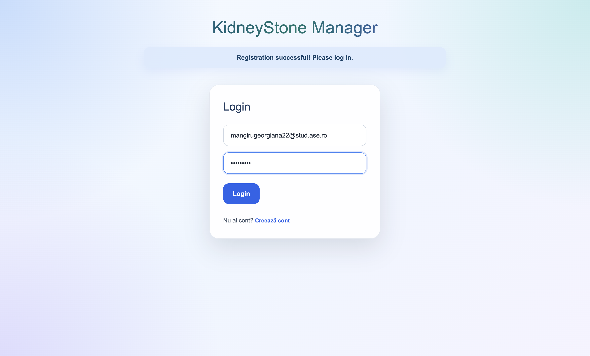

### Register

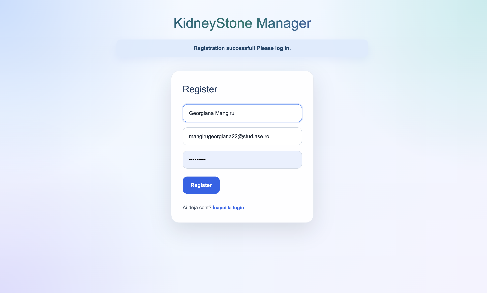

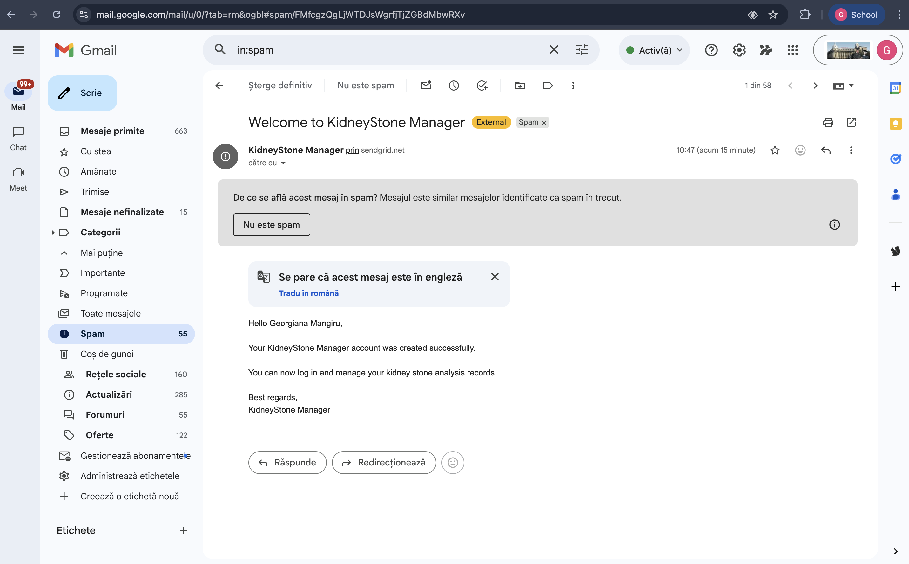

### Dashboard

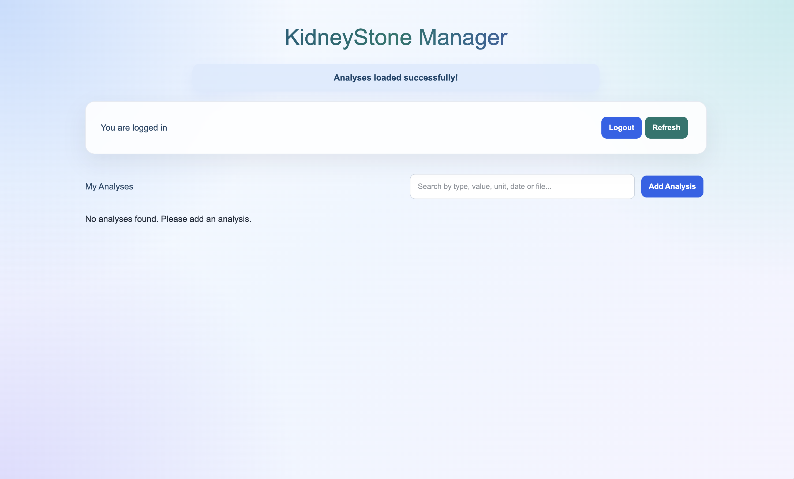

### Add Analysis

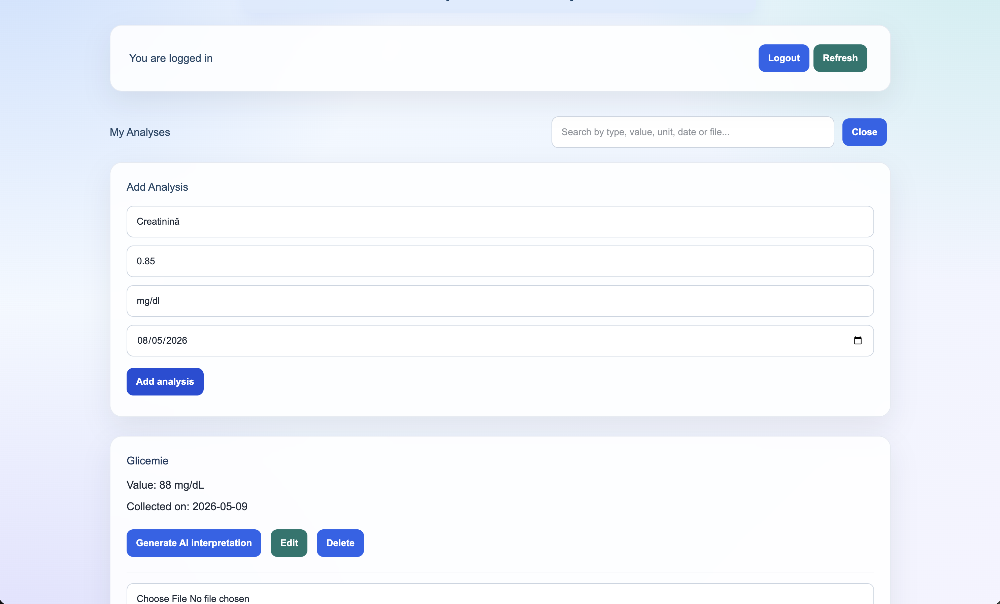

### Edit Analysis
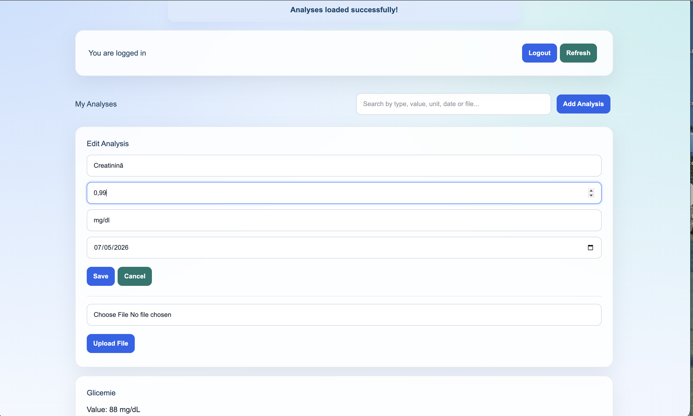

### Listă analize

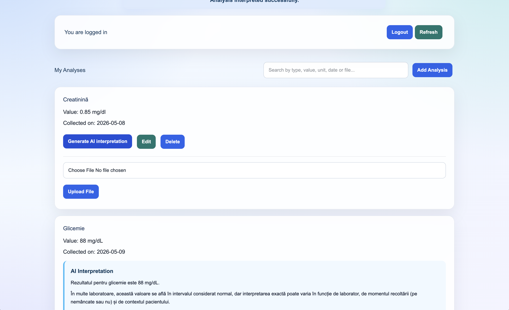

### Search / filtrare analize

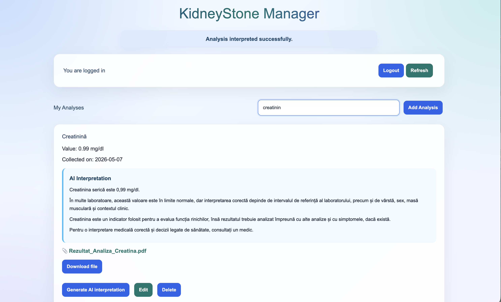(docs/images/search-analyses-collection-date.png)(docs/images/search-analyses.png)

### Interpretare AI

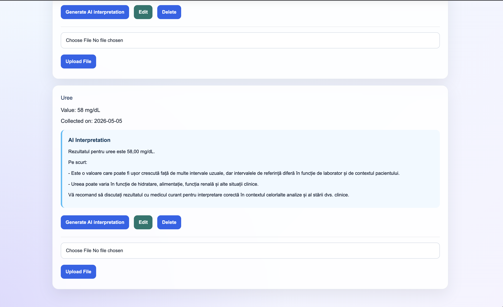(docs/images/ai-interpretation-load.png)(docs/images/ai-interpretation.png)

### Upload fișier

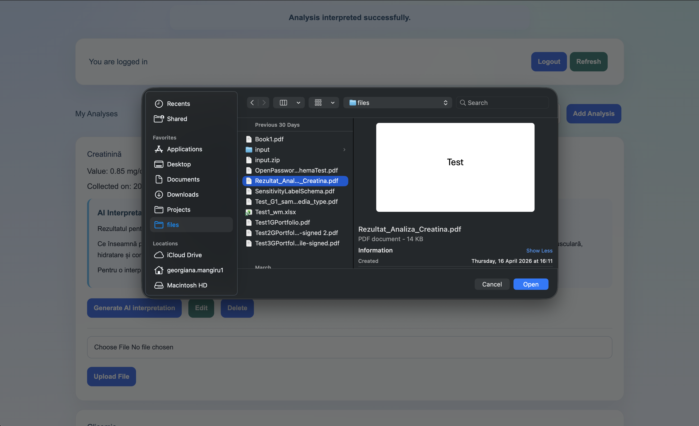(docs/images/upload-file.png)

### Download fișier

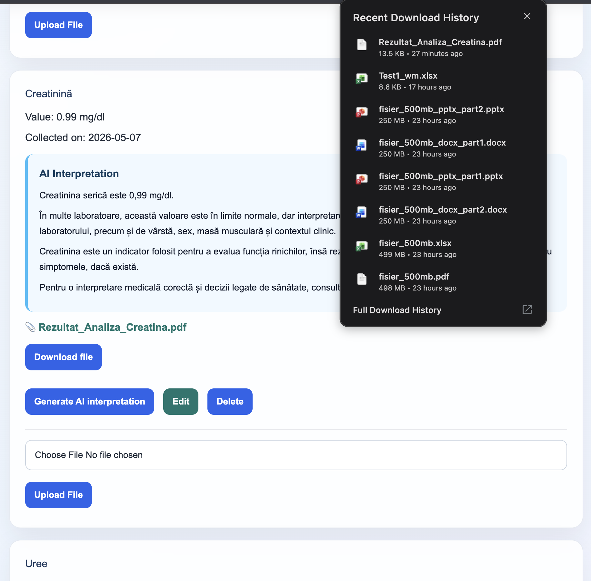

---

## 6. Publicare aplicație

Aplicația va fi publicată folosind o platformă cloud.

Link aplicație publicată:

```text
https://kidneystone-application-production-e99f.up.railway.app/
```

Link video prezentare:

```text
https://drive.google.com/drive/folders/1a_USeUuW-yMq7Ydul_hQ1Q5vbMOVDKHI
```

---

## 7. Rulare locală

### Backend

Pentru rularea backend-ului:

```bash
cd backend
set -a && source .env && set +a && ./gradlew bootRun
```

Backend-ul rulează pe:

```text
http://localhost:8080
```

---

### Frontend

Pentru rularea frontend-ului:

```bash
cd frontend
npm install
npm run dev
```

Frontend-ul rulează pe:

```text
http://localhost:5173
```

---

## 8. Variabile de mediu

Backend-ul folosește variabile de mediu pentru cheile API și configurațiile sensibile.

Exemplu `.env`:

```env
DATABASE_URL=...
DATABASE_USERNAME=...
DATABASE_PASSWORD=...

JWT_SECRET=...

SENDGRID_API_KEY=...
SENDGRID_FROM_EMAIL=...
SENDGRID_FROM_NAME=KidneyStone Manager

OPENAI_API_KEY=...
OPENAI_MODEL=...
```

Fișierul `.env` nu trebuie publicat în repository și trebuie inclus în `.gitignore`.

---

## 9. Referințe

- React Documentation: https://react.dev/
- Spring Boot Documentation: https://spring.io/projects/spring-boot
- Spring Security Documentation: https://spring.io/projects/spring-security
- PostgreSQL Documentation: https://www.postgresql.org/docs/
- Railway Documentation: https://docs.railway.app/
- OpenAI API Documentation: https://platform.openai.com/docs
- SendGrid Documentation: https://docs.sendgrid.com/
- JWT Introduction: https://jwt.io/introduction
- MDN Web Docs - Fetch API: https://developer.mozilla.org/en-US/docs/Web/API/Fetch_API
